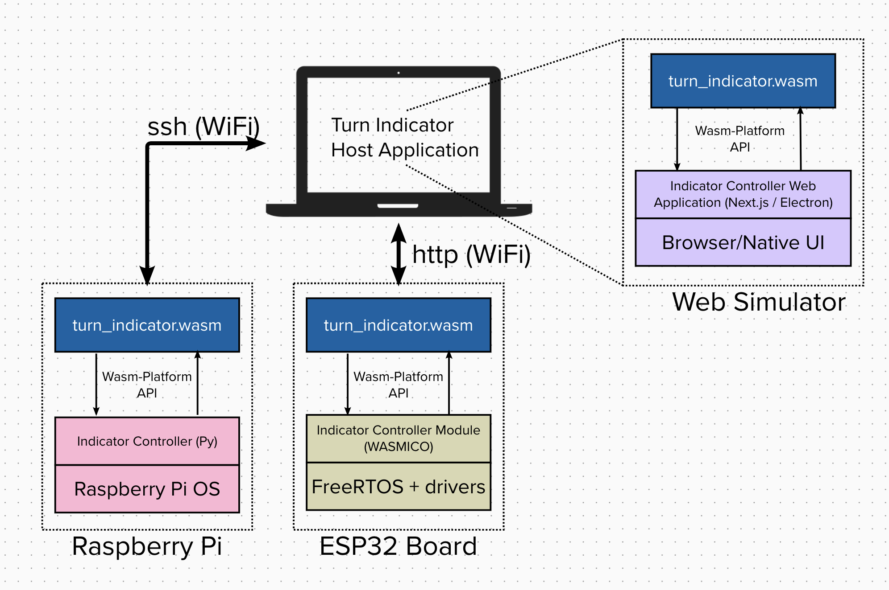
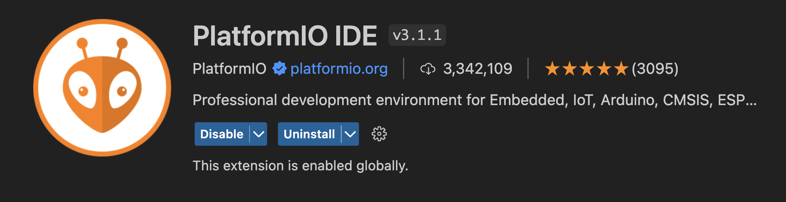
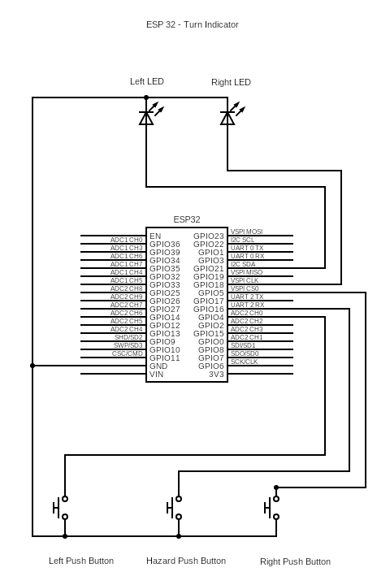
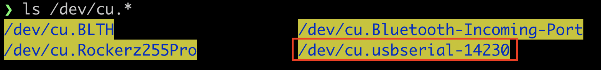
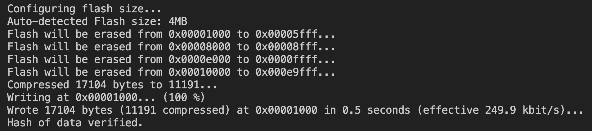
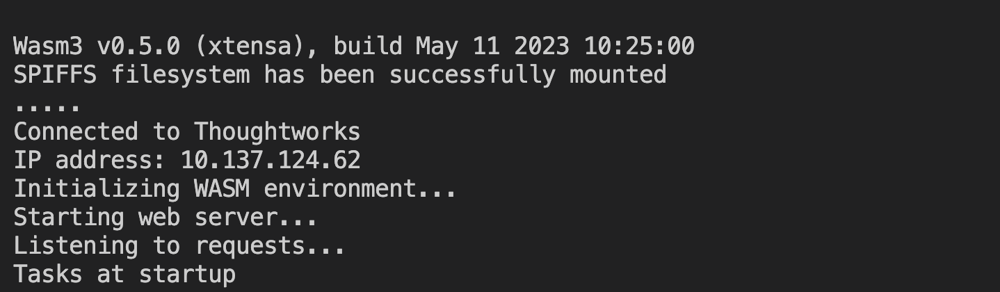
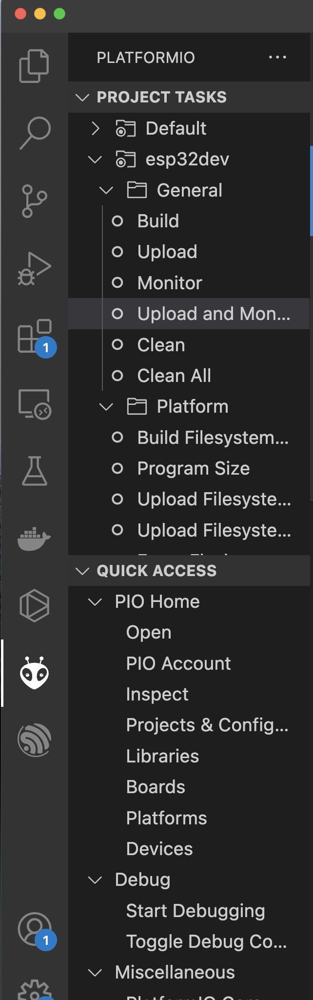

# WebAssembly Demo on Multiple Platforms

The demo implements traffic controller application in Rust. The application is built using Rust tools to Wasm target. The generated binary is run on three different platforms - Web, ESP32 and Raspberry Pi.

Following diagram shows the setup and associated software components



Each platform has a Wasm runtime with a platform interface application (called as `Indicator Controller`) which integrates with Wasm binary (`turn_indicator.wasm`) and provides platform specific API for reading push button status and updating LED status.

## Hardware setup

### Components

1. Raspberry Pi with indicator board
2. ESP32 board with indicator board
3. Laptop
4. WiFi hotspot

## Demo setup

### Network configuration

1. The laptop should be connected to the internet.
2. The ESP32 and Raspberry Pi should be connected to the laptop over local network.

### Setup Raspberry Pi

1. Connect the Raspberry Pi to the display using HDMI and connect the Raspberry pi to WiFi hotspot. Note down the ip
   address from `ifconfig`
2. Setup the ssh key so that the password will not be promted everytime we do ssh or scp. Follow
   this [link](https://danidudas.medium.com/how-to-connect-to-raspberry-pi-via-ssh-without-password-using-ssh-keys-3abd782688a)
   untill **Copy public key to Raspberry Pi**
3. Copy the required files into the Raspberry Pi

Copy the Python script on the device. The Python script is the application which binds with the wasm binary and provides platform APIs for the Wasm module.

```bash
scp wasm_rpi/rpi_left_right_indicator.py pi@{raspberry_ip_address}:/home/pi/wasm
```

Copy the wasm binary to the device.

```bash
scp web/next_app/public/turn_indicator.wasm pi@{raspberry_ip_address}:/home/pi/wasm
```

> Note: While exhecuting the above commands, the ssh password should not be promted. If not, retry the 2nd point again.

4. Now, start the python script by running the following command.

```bash
ssh pi@{raspberry_ip_address} '/usr/bin/python3 /home/pi/wasm/rpi_left_right_indicator.py'
```

> Note:
>
> 1. After the python script on RPi starts running and as the wasm binary is already copied on the target, the application should start running.
> 2. You can verify by pressing indicator buttons and observing the indicator LEDs.
> 3. After every power cycle/reboot, the python script must be started by executing command in 4.

### Setup for ESP32

We will be using Visual studio code for flashing the code to ESP32.

1. Install VS code using [this link](https://code.visualstudio.com/download)
2. Install `PlatformIO` plugin 
3. Connect the GPIO pins of ESP32 with buttons and LEDs' as shown in the image below. 
4. Connect the ESP32 to the Host machine (PC) using a USB cable.
5. Verify if the ESP32 is connected by running the following command `ls /dev/cu.*` (for MacOS)
   
6. To enable ESP32 to connect with your local network, update the wifi access point details in the source code. Replace the `WIFI_SSID` and `WIFI_PASS` with correct values in the `platform.ini` file present in `platforms/tool/` with the content `build_flags =
   -D WIFI_SSID='"wifi"'
   -D WIFI_PASS='"password"'`
7. Upload and monitor using following command:

   ```bash
   platformio run --target upload --target monitor --environment esp32dev 
   ```

   
   You can see all the console messages in VS Code monitor window.

8. You can see an IP is printed by the ESP32 monitor window once it is connected to the wifi. You can use this IP in the WebUI. (You can check the `platforms/tool/readme.md` for manually uploading and running the wasm from your terminal) 

> Note:
>
> 1. The IP address of ESP32 should be noted here. This IP address can be used on the Web App to flash wasm binary from Web App.
> 2. Step 7 can be done in the GUI. As shown in the image below. First select the `PlatformIO` from the sidebar then click `Upload and Monitor`.


Now the ESP32 is ready to be tested using the WebUI.

## Web Application

The Wasm Demo App is a web application which provides a single user interface to build, deploy and run the traffic controller Wasm application binary on three different platforms - Web, Raspberry Pi and ESP32.

It should be noted that the objective of the application is not to provide a generic user interface and is meant for only the traffic controller implementation.

As of now, this application is tested in the development mode only. This document describes steps needed to run the application in the development mode.

## Basic installation

This application is developed using [Next.js](https://nextjs.org/docs) framework which is based on React.

The application can be built and run on MacOS, Linux and Windows platforms.

### Install/update Node.js

1. As a first step, install [Node.js](https://nodejs.org/en).
2. If you already have Node.js installed on your machine, ensure the version is 16.8.0 or higher.

### Install the Wasm Demo App

1. Run a shell terminal in `.../rust-katas/web/next_app` directory.
2. Run the following command to install node.js packages.

   ```bash
   npm install
   ```

3. That's all! You can run the application now in the development mode with following command.

   ```bash
   npm run dev
   ```

This command should start a server on <http://localhost:3000>. Open this url in a browser to see the application running.
